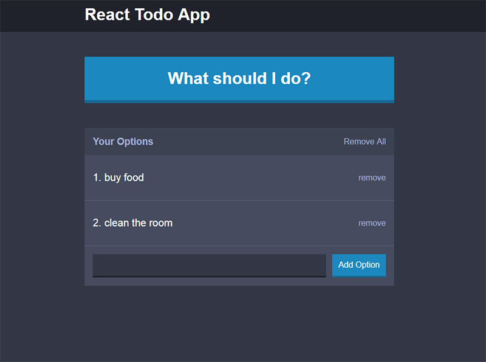

# Todo App

Classic to-do app I built as a part of [The Complete React Web Developer Course (with Redux)](https://www.udemy.com/react-2nd-edition).

## [Live demo](https://react-todo-app-project.herokuapp.com)

## Features:
- Add new to-do
- Delete individual to-do item
- Delete all to-do items
- Clicking "What should I do?" button selects a random to-do item to display in a modal

## Screenshot:

